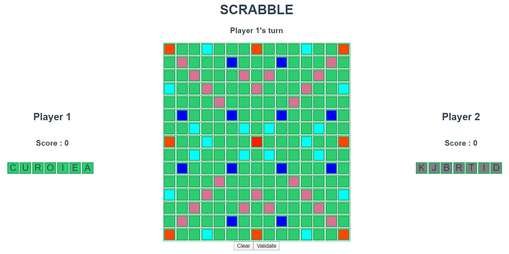

# Scrabble

A small Scrabble game made with VueJs for practice... and fun.

## Demo

See built version here [https://sakasaky.github.io/scrabble-vue/](https://sakasaky.github.io/scrabble-vue/)


## Project setup

```
yarn install
```

### Compiles and hot-reloads for development

```
yarn serve
```

### Compiles and minifies for production

```
yarn build
```

### Customize configuration

See [Configuration Reference](https://cli.vuejs.org/config/).
